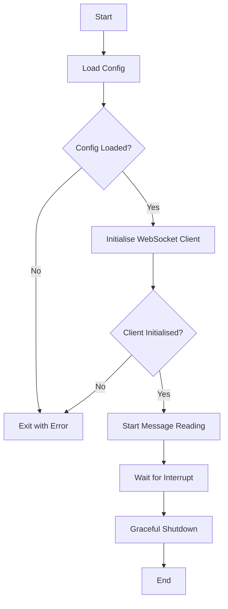
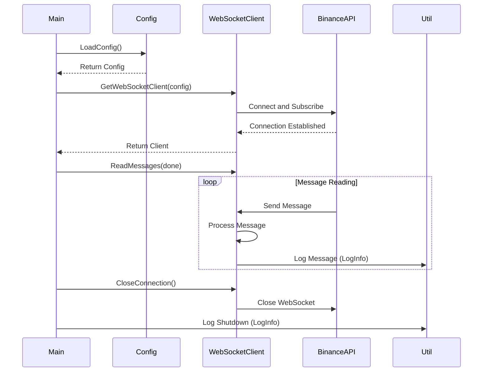

# HFTCryptoDashboard

HFTCryptoDashboard is a Go-based application for real-time cryptocurrency data streaming and analysis, focusing on high-frequency trading (HFT) scenarios.

## Project Structure

The project is organised into several key components:

1. `main.go`: The entry point of the application.
2. `config.yaml`: Configuration file for specifying cryptocurrency symbols.
3. `config.go`: Handles loading and parsing of the configuration.
4. `signal.go`: Manages graceful shutdown of the application.
5. `client.go`: Implements the WebSocket client for connecting to the Binance API.
6. `util.go`: Provides utility functions for logging, error handling, and other common tasks.

## Application Flow

### Flowchart



### Sequence Diagram



## Key Components

1. **Config**: Loads and parses the `config.yaml` file, which contains the list of cryptocurrency symbols to monitor.

2. **WebSocketClient**: Manages the WebSocket connection to the Binance API. It's implemented as a singleton to ensure only one connection is maintained throughout the application's lifecycle.

3. **Main**: Orchestrates the application flow, including config loading, client initialisation, and graceful shutdown handling.

4. **Handlers**: Contains utility functions for managing application signals and interrupts.

5. **Util**: Provides a set of utility functions for common tasks such as logging, error handling, HTTP requests, and more. These functions are used throughout the application to maintain consistency and reduce code duplication.

## Utility Functions (util.go)

The `util.go` file contains a variety of helper functions that are used throughout the application:

- **Logging**: `LogInfo`, `LogError`, and `LogAndExit` for different levels of logging.
- **Error Handling**: `CheckError` for standardised error checking.
- **Configuration**: `FileExists` and `ValidateConfig` for config-related operations.
- **String Manipulation**: `ToUpperCase`, `ToLowerCase`, and `Contains` for string operations.
- **HTTP Requests**: `MakeGetRequest` for making HTTP GET requests.
- **Time Utilities**: `CurrentTimestamp` and `ParseTimestamp` for working with timestamps.
- **Retry Mechanism**: `Retry` for implementing retry logic on operations that may fail.

These utilities enhance the robustness and maintainability of the application by providing consistent ways to handle common operations.

## Getting Started

1. Ensure you have Go installed on your system.
2. Clone the repository.
3. Modify `configs/config.yaml` to include the cryptocurrency symbols you want to monitor.
4. Run the application:

   ```
   go run main.go
   ```

5. The application will connect to the Binance WebSocket API and start streaming real-time data for the specified symbols.

## Note

This application is designed for educational purposes and should be thoroughly tested and potentially optimised before use in any production or real trading scenarios.
